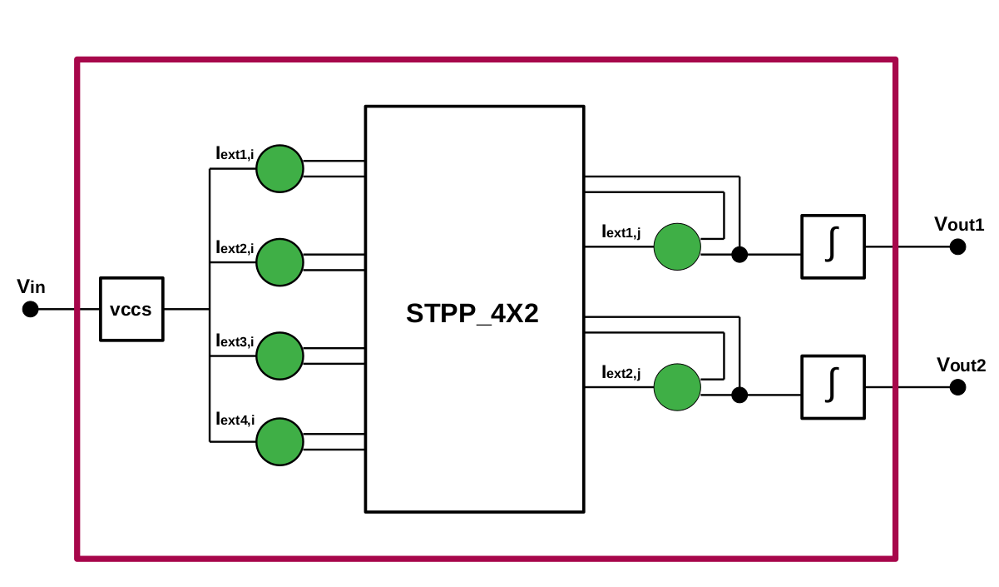
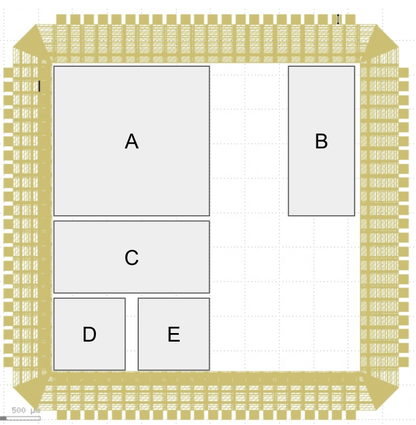
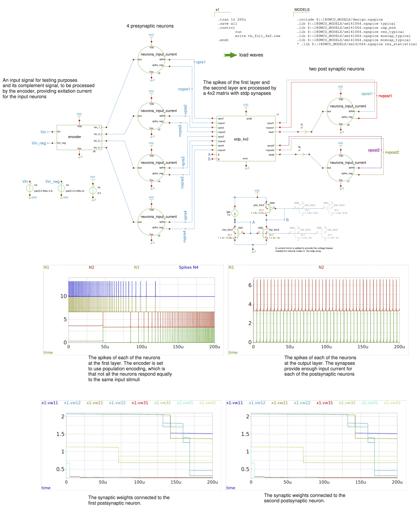
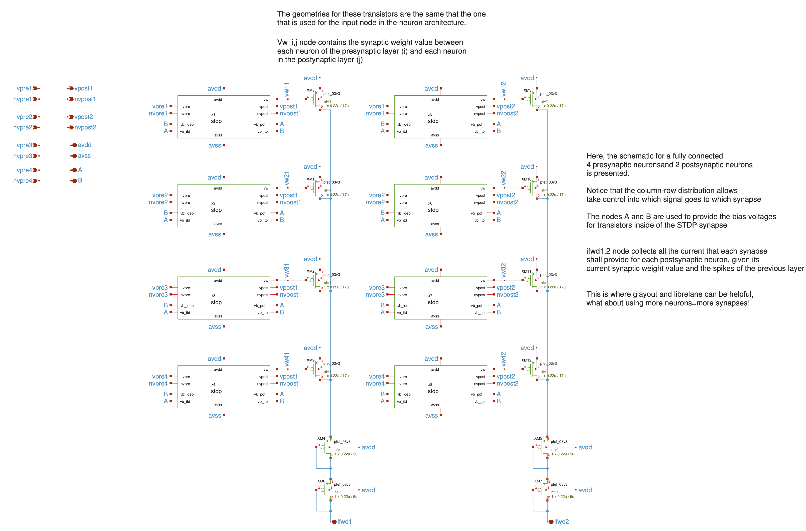

# General Schematic (Updated 16 July)

The figure below shows the overall architecture of the project. The implemented spiking neural network consists of an encoder block, four input neurons, a 4×2 STPP synaptic array, and two output neurons. The encoder block is composed of a Voltage-Controlled Current Source (VCCS), which converts the input voltage into a proportional current. Each output neuron is connected to an integrator circuit that generates the corresponding output voltage based on the network activity.

For ease of navigation and documentation, each functional block of the design has its own dedicated folder within the repository, containing its corresponding information, schematics, and implementation details.

## Pin out 
This project requires six chip pins:

* **VDD**: Power supply
* **GND**: Ground
* **VIN1**: Input voltage
* **VOUT1**: Output voltage 1
* **VOUT2**: Output voltage 2
* **VW**: Test pin for monitoring the synaptic voltage.

According to these requirements, Configuration Block C was selected, as it provides six available pins for the project. These six pins are sufficient to monitor and plot the behavior of a single synaptic weight. If simultaneous observation of additional synaptic weights is required, extra pins must be allocated accordingly.

# Schematic Simulations
Here is the schematic of all the blocks working together, intended to be included in the tapeout

4 neurons in a first layer are connected to 2 output neurons (post-synaptic) via an array of 4x2 synapses with STDPs cells. Here is the inside the stdp/stdo_4x2.sym :

## General assumptions
Voltage operation: 3.3V. 
All nodes start from zero volts
