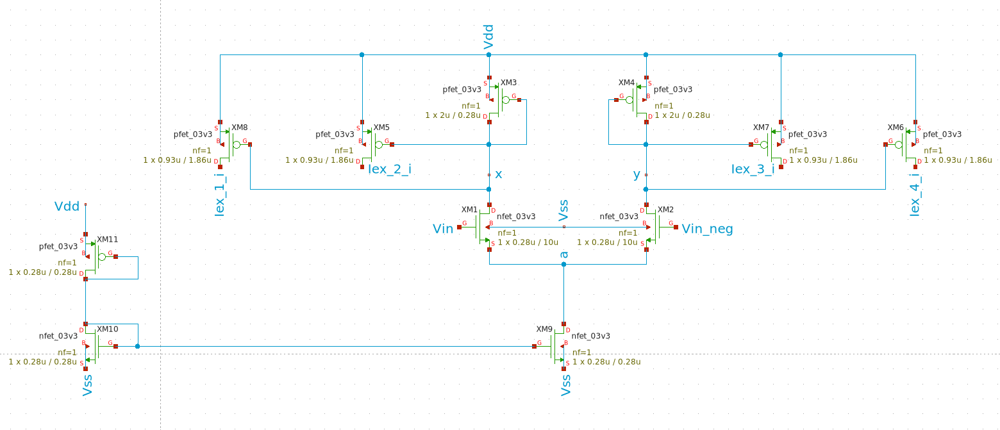
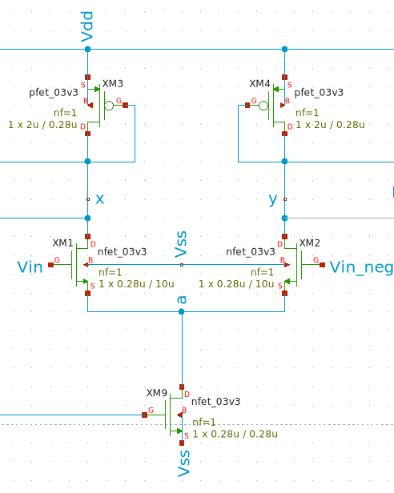
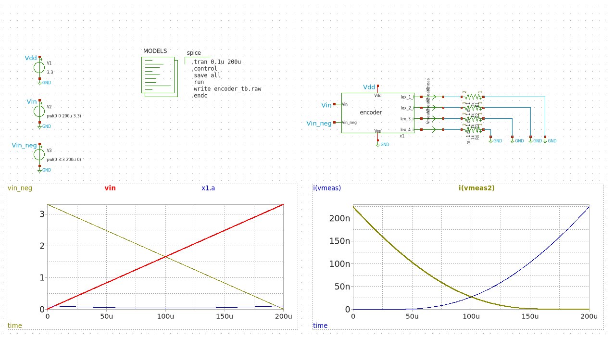

# Encoder 
The figure below shows the encoder circuit that we propose to controlled the current in the neuron.


## How its works
The encoder consists of a Voltage-Controlled Current Source (VCCS) implemented using a differential pair, which converts the input voltage into a proportional output current. 


One branch of the differential pair includes a diode-connected PMOS transistor, from which a reference voltage is generated. The voltage at this node is given by:
```math
V_{out} = V_{dd} - R_D \cdot \frac{I_{ss}}{2}
```
The factor of 1/2 arises from the current division in the differential pair, while the voltage expression also accounts for the intrinsic output resistance of the diode-connected PMOS transistor. 

The PMOS output resistance is given by:
```math
R_{ds} = (\frac{\partial i_d}{\partial V_{ds}}})^{-1}
```
This results in the following expression:
```math
R_{ds} = \frac{1}{\lambda I_d}
```
This voltage is defined as $V_{bias}$, which is used to control the operation of the input neurons.

## Testbench
To verify the functionality of the proposed encoder, the testbench show below was implemented. A differential input signal was applied by linearly increasing $V_{in}$ from 0 V to 3.3 V while simultaneously decreasing $V_{in_neg}$ from 3.3 V to 0 V over a simulation time of $200\mu s$.


The output currents exhibit complementary behavior. When Vin increases, the current through one branch increases while the current through the opposite branch decreases.
These results confirm the correct operation of the encoder and its ability to convert the differential input voltage into the corresponding output current distribution.
