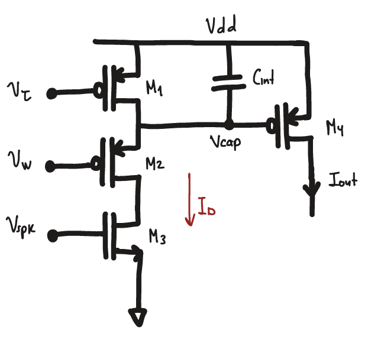
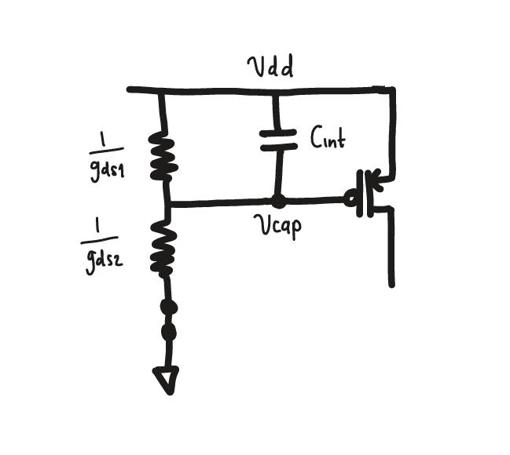
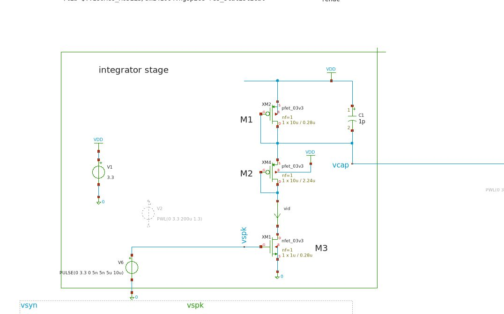
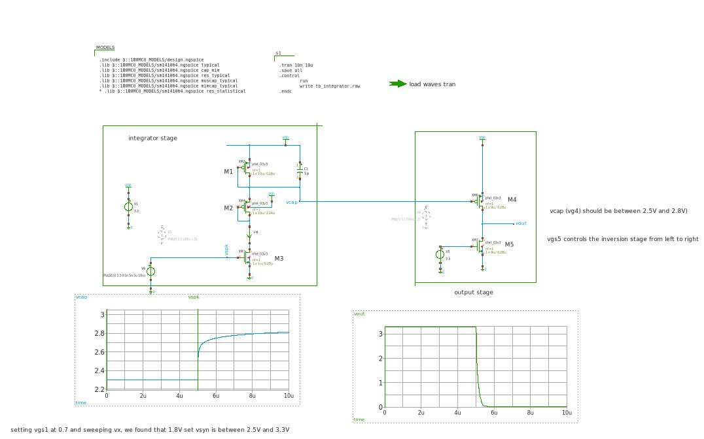

# Integrator

Based on [1], here is the Integrator circuit using a subthreshold first-order LPF circuit, implemented in the gf180mcuD pdk. 


## How it works
Given the original circuit LPF proposed at [1], we can obtain the next expression for the first branch:
```math
V_{cap} = V_{dd} - I_1 R_1 - I_2 R_2 - I_3 R_3
```
Given that: 
```math
R_1 = \frac{1}{g_{ds1}}, R_2 = \frac{1}{g_{gds2}}, R_3 = \frac{1}{g{ds3}}
```
And the fact that $I_D=I_1=I_2=I_3$, we can rewrite [1] as:
```math
V_{cap} = V_{dd} - I_D (\frac{1}{g_{ds1}+g_{ds2}+g_{ds3}})
```
Where $g_{ds}$ is the small signal channel conductance
```math
g_{ds} = \frac{I_D \lambda}{1+ \lambda \cdot V_{DS}} \approx I_D \cdot \lambda 
```
$\lambda$ is the channel lenght modulation of each transistor in saturation. We can, for this last reason. redraw as: 



> **Note:** as $M_3$ is in saturation, a spike arriving sets the transistor in saturation, this is $V_{spk} > V_{th,n}$

We can write
```math
V_{cap} = \frac{R_2}{R_1+R_2} \cdot V_{dd}
```
```math
V_{cap} = \frac{\frac{1}{g_{ds2}}}{\frac{1}{g_{ds1}+g_{ds2}} \cdot V_{dd}}
```

```math
v_{cap} = \frac{1/g_{ds2}}{1/g_{ds1}+1/g_{ds2}}
```
Replacing with $g_{ds1} \approx \lambda_1 I_D$, we can have

```math
v_{cap} = \frac{1/{\lambda_2 \cancel{I_D}}}{1/{\lambda_1 \cancel{I_D}}+1/{\lambda_2 \cancel{I_D}}} v_{dd}
```
Then:
```math
v_{cap} = \frac{1}{{\lambda_2}/{\lambda_1 }+1}  v_{dd}
```

We then can rewrite 
```math
v_{cap} = \eta v_{dd}
```

setting $\eta =\frac{1}{{\lambda_2}/{\lambda_1 }+1}$

Then, as $v_{cap}$ controls the gate of M4, we can drive this transistor in triode region by setting  $v_{cap}\in\left[ 3.3V, 2.6V\right]$. For the upper limit, no spikes should arrive at the transistor M3, however, for the lower bound, we can set $v_{cap} = 2.6V$ and $v_{dd}=3.3$ and then 

```math
v_{cap} = \eta v_{dd}
```
```math
2.6 = \eta 3.3
```
```math
\eta = 0.78
```
Then, by setting $\lambda_2$ fized, we can solve for $\lambda_2$

```math
\eta = 0.78 =\frac{1}{{\lambda_2}/{\lambda_1 }+1}
```
```math
\lambda_2 = 0.28 \lambda_1 
```

This is, assuming all transistors $M1, M2, M3$ are in saturation. We can accomplish this by setting the M1 and M2 as triode


The channel length $L_1$ and $L_2$ then selected to accomplish the boundries of $v_cap$

## How to test
The testbench for this circuit consists of the integrator block driven by a neuron model that generates a train of pulses, allowing the circuit's operation and dynamic behavior to be evaluated.



## 📚 References
    - Hazan A and Ezra Tsur E (2021) Neuromorphic Analog Implementation of Neural Engineering Framework-Inspired Spiking Neuron for High-Dimensional Representation. Front. Neurosci. 15:627221. doi: 10.3389/fnins.2021.627221
    - Roy, K., Jaiswal, A. & Panda, P. Towards spike-based machine intelligence with neuromorphic computing. Nature 575, 607–617 (2019). https://doi.org/10.1038/s41586-019-1677-2
