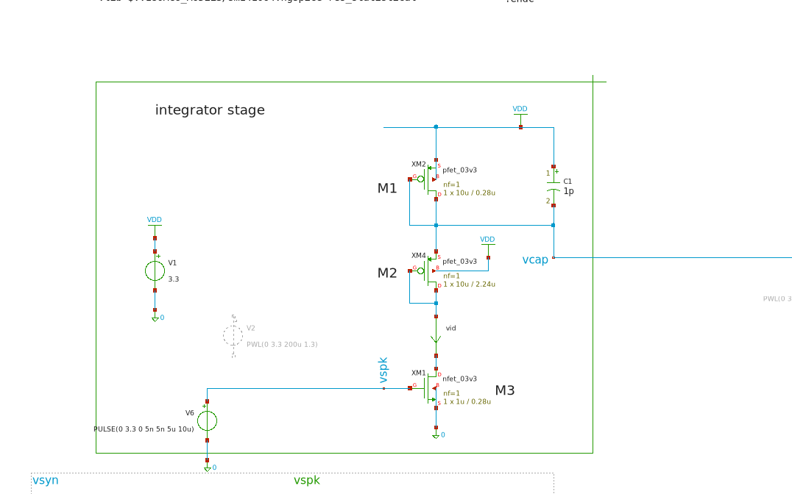

```math
v_{cap} = \frac{1/g_{ds2}}{1/g_{ds1}+1/g_{ds2}}
```
Replacing with $g_{ds1} \approx \lambda_1 I_D$, we can have

```math
v_{cap} = \frac{1/{\lambda_2 \cancel{I_D}}}{1/{\lambda_1 \cancel{I_D}}+1/{\lambda_2 \cancel{I_D}}} v_{dd}
```
Then:
```math
v_{cap} = \frac{1}{{\lambda_2}/{\lambda_1 }+1}  v_{dd}
```

We then can rewrite 
```math
v_{cap} = \eta v_{dd}
```

setting $\eta =\frac{1}{{\lambda_2}/{\lambda_1 }+1}$

Then, as $v_{cap}$ controls the gate of M4, we can drive this transistor in triode region by setting  $v_{cap}\in\left[ 3.3V, 2.6V\right]$. For the upper limit, no spikes should arrive at the transistor M3, however, for the lower bound, we can set $v_{cap} = 2.6V$ and $v_{dd}=3.3$ and then 

```math
v_{cap} = \eta v_{dd}
```
```math
2.6 = \eta 3.3
```
```math
\eta = 0.78
```
Then, by setting $\lambda_2$ fized, we can solve for $\lambda_2$

```math
\eta = 0.78 =\frac{1}{{\lambda_2}/{\lambda_1 }+1}
```
```math
\lambda_2 = 0.28 \lambda_1 
```

This is, assuming all transistors $M1, M2, M3$ are in saturation. We can accomplish this by setting the M1 and M2 as triode


The channel length $L_1$ and $L_2$ then selected to accomplish the boundries of $v_cap$