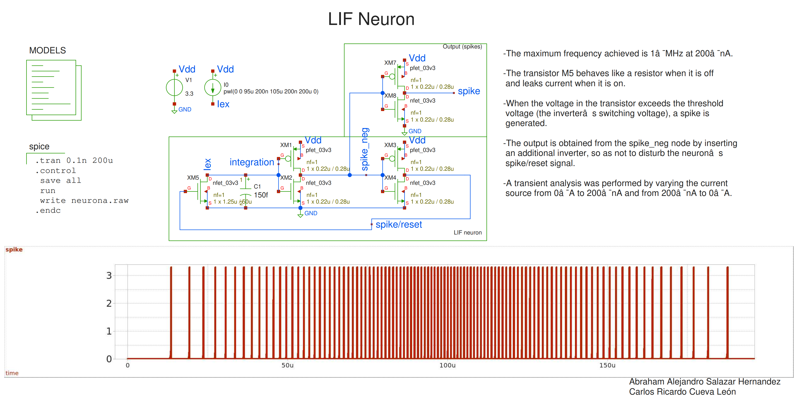
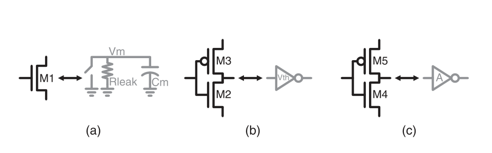

# Dual-Mode CMOS LIF Neuron


Based on \[1], here is the dual-mode leaky integrate-and-fire (LIF) neuron, implemented in the gf180mcuD pdk.





## How it works

The membrane node integrates an excitation current  $I_{ex}$  on capacitance $C_m$ and continuously leaks through $R_{leak}$:


```math
\tau = R_{leak} \cdot C_m
```


```math

V_m(t) \rightarrow R_{leak} \cdot I_{ex} \quad\text{(as } t \rightarrow \infty \text{, until threshold crossing)}

```


When $V\_m$ crosses the firing threshold $V_{th(lif)}$, the neuron spikes and resets. Firing rate encodes input current.


One transistor (M1) is left in subthreshold — not truly off, just conducting a small diffusion current that grows exponentially with $V_{gs}$:


```math

I_d \approx I_0 \cdot \exp\left(\frac{V_{gs}}{n \cdot V_t}\right) \cdot \left(1 - \exp\left(-\frac{V_{ds}}{V_t}\right)\right)

```


At nanoamp-scale $I_d$ and volt-scale $V_{ds}$, $R_{leak} = V_{ds}/I_d$ lands naturally in the MΩ–GΩ range. The rest of the circuit (M2–M5, two inverter stages) stays in saturation, giving full-swing output with no extra amplifier.


Since $V_{ds} = V_m$ in this topology, the leak resistance at the drain of M1 is:


```math

R_{leak} = \left| \frac{V_m}{I_0 \exp \left(-\dfrac{V_{th}}{n V_t}\right)\left(1 - e^{-V_m/V_t}\right)} \right|

```


$R\_leak$ is therefore not constant — it depends on $V_m$ and is only piecewise-linear over the integration range, which justifies linearizing it as an average around the midpoint between reset and threshold:


```math

\bar{R}_{leak} \approx \frac{V_{th(lif)} + V_{reset}}{2 I_0 \exp\left(-\dfrac{V_{th}}{n V_t}\right)\left(1 - \exp\left(-\dfrac{V_{th(lif)} + V_{reset}}{2 V_t}\right)\right)}

```


This average feeds the closed-form firing-frequency model:


```math

f = \frac{1}{\bar{R}_{leak} \cdot C_m \cdot \ln\left(\dfrac{-\bar{R}_{leak} I_{ex}}{V_{th(lif)} - \bar{R}_{leak} I_{ex}}\right)}

```


### The three stages





| Stage | Devices | Function |

|---|---|---|

| (a) Integrate \& reset | M5 (subthreshold) | Charges $C_m$ via $I\_ex$; leaks via $R\_leak$; dumps charge on reset |

| (b) Threshold \& spike | M1–M2 (inverter) | Trip point = $V_th(lif)$, the firing threshold |

| (c) Gain \& feedback reset | M3–M4 (inverter) | Full-swing spike out; feeds a reset pulse back into M1 |

| (d) Output |M6–M7 (inverter)|Spikes|


## Schematic

nfet_03v3 / pfet_03v3 devices, $Vdd = 3.3V$. Captured in xschem, no simulation or layout yet.


| Device | Role | Notes |

|---|---|---|

| M5 |leakage resistance (subthreshold) and reset | $V_{gs}$ is low ⇒ $R_leak$ ; $V_{gs}$ is high ⇒ `reset`|

| C1 = 150 fF | $C_m$ | carried over roughly, not re-derived |

| M1–M2 inverter | LIF threshold | Inverted output signal |

| M3–M4 inverter | Spike/Reset | Reset signal |

| M6–M7 inverter | Spike | Output signal (spike) |

| I0  | $I_{ex}$ | max 200 nA |


## Sizing

| Parameter | Value |

|---|---|

| $V_{dd}$ | 3.3 V (`\*\_03v3` devices) |

| Devices | `nfet\_03v3` / `pfet\_03v3` |

| $C_m$ | 150 fF |

| $V_{th(lif)}$ | 1.3 V |

| Transistor count | 7T|

| $I_{ex}$ | max 200 nA |

| Firing frequency range | up to 1 mHz  |

| Average $R_{leak}$ | 495 GOhms |

| W/L sizing (all devices) | M5=0.025, M1-M4 and M5-M7 = 0.78|


## How to test

1\. Constant $I_{ex}$ → steady spike train at expected frequency

2\. Ramp/step $I_{ex}$ → frequency tracks input monotonically


## 📚 References

&#x20;   - A. A. Salazar-Hernandez, V. H. Ponce-Ponce, H. Molina-Lozano, J. H. Sossa-Azuela, J. J. Ocampo-Hidalgo, Dual-Mode CMOS LIF Neuron With Subthreshold Efficiency and Saturation-Driven Robustness, IEEE Access, 2026, Volume 14, Pages 27290-27302, doi: 10.1109/ACCESS.2026.3663914

