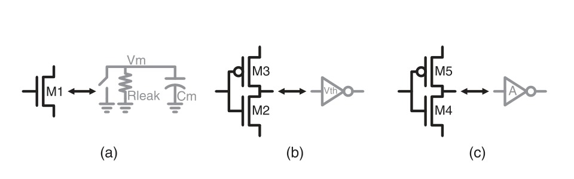
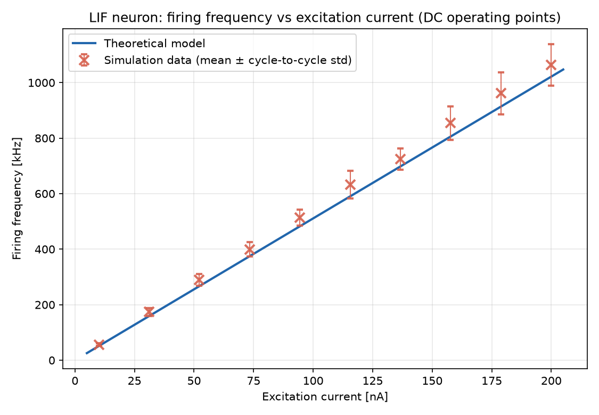

# Dual-Mode CMOS LIF Neuron

Based on \[1], here is the dual-mode leaky integrate-and-fire (LIF) neuron, implemented in the gf180mcuD pdk.


## How it works

The membrane node integrates an excitation current  $I_{ex}$  on capacitance $C_m$ and continuously leaks through $R_{leak}$:

```math
\tau = R_{leak} \cdot C_m
```

```math

V_m(t) \rightarrow R_{leak} \cdot I_{ex} \quad\text{(as } t \rightarrow \infty \text{, until threshold crossing)}

```

When $V\_m$ crosses the firing threshold $V_{th(lif)}$, the neuron spikes and resets. Firing rate encodes input current.

One transistor (M1) is left in subthreshold — not truly off, just conducting a small diffusion current that grows exponentially with $V_{gs}$:

```math

I_d \approx I_0 \cdot \exp\left(\frac{V_{gs}}{n \cdot V_t}\right) \cdot \left(1 - \exp\left(-\frac{V_{ds}}{V_t}\right)\right)

```

At nanoamp-scale $I_d$ and volt-scale $V_{ds}$, $R_{leak} = V_{ds}/I_d$ lands naturally in the MΩ–GΩ range. The rest of the circuit (M2–M5, two inverter stages) stays in saturation, giving full-swing output with no extra amplifier.

Since $V_{ds} = V_m$ in this topology, the leak resistance at the drain of M1 is:

```math

R_{leak} = \left| \frac{V_m}{I_0 \exp \left(-\dfrac{V_{th}}{n V_t}\right)\left(1 - e^{-V_m/V_t}\right)} \right|

```

$R\_leak$ is therefore not constant — it depends on $V_m$ and is only piecewise-linear over the integration range, which justifies linearizing it as an average around the midpoint between reset and threshold:

```math

\bar{R}_{leak} \approx \frac{V_{th(lif)} + V_{reset}}{2 I_0 \exp\left(-\dfrac{V_{th}}{n V_t}\right)\left(1 - \exp\left(-\dfrac{V_{th(lif)} + V_{reset}}{2 V_t}\right)\right)}

```

This average feeds the closed-form firing-frequency model:

```math

f = \frac{1}{\bar{R}_{leak} \cdot C_m \cdot \ln\left(\dfrac{-\bar{R}_{leak} I_{ex}}{V_{th(lif)} - \bar{R}_{leak} I_{ex}}\right)}

```

### The three stages



| Stage | Devices | Function |
|---|---|---|
| (a) Integrate \& reset | M5 (subthreshold) | Charges $C_m$ via $I\_ex$; leaks via $R\_leak$; dumps charge on reset |
| (b) Threshold \& spike | M1–M2 (inverter) | Trip point = $V_th(lif)$, the firing threshold |
| (c) Gain \& feedback reset | M3–M4 (inverter) | Full-swing spike out; feeds a reset pulse back into M1 |
| (d) Output |M7–M8 (inverter)|Spikes|

## Schematic

nfet_03v3 / pfet_03v3 devices, $Vdd = 3.3V$. Captured in xschem, no simulation or layout yet.

| Device | Role | Notes |
|---|---|---|
| M5 |leakage resistance (subthreshold) and reset | $V_{gs}$ is low ⇒ $R_leak$ ; $V_{gs}$ is high ⇒ `reset`|
| C1 = 150 fF | $C_m$ | carried over roughly, not re-derived |
| M1–M2 inverter | LIF threshold | Inverted output signal |
| M3–M4 inverter | Spike/Reset | Reset signal |
| M7–M8 inverter | Spike | Output signal (spike) |
| M6 | Current mirror (diode-connected pfet) | Mirrors $I_{ex}$ from I0 into M5's drain, replacing the ideal current source used in earlier versions |
| I0  | $I_{ex}$ reference | max 200 nA |

Operational notes:
- M5 behaves like a resistor when it is off, and leaks current when it is on.
- When the voltage at M5's node exceeds the inverter's switching threshold, a spike is generated.
- The output is taken from the `spike_neg` node through an additional inverter (M7–M8), so it does not disturb the neuron's `spike/reset` signal.
- $I_{ex}$ is no longer supplied by an ideal current source directly into M5. Instead, I0 references a diode-connected pfet (M6), which mirrors the current into M5's drain — this avoids the finite output impedance and unrealistic behavior of an ideal source.

## Sizing

| Parameter | Value |
|---|---|
| $V_{dd}$ | 3.3 V (`\*\_03v3` devices) |
| Devices | `nfet\_03v3` / `pfet\_03v3` |
| $C_m$ | 150 fF |
| $V_{th(lif)}$ | 1.3 V |
| Transistor count | 7T|
| $I_{ex}$ | max 200 nA |
| Firing frequency range | up to 1 MHz  |
| Average $R_{leak}$ | 495 GOhms |
| W/L sizing (all devices) | M5=0.025, M1-M4 and M7-M8 = 0.78, M6 = 0.013 (17µ/0.22µ) |

## How to test

1\. Constant $I_{ex}$ → steady spike train at expected frequency

2\. Sweep $I_{ex}$ from 0 to 200 nA and back to 0 nA (PWL, e.g. `pwl(0 0 95u 200u 105u 200u 200u 0)`) → frequency tracks input monotonically in both directions. Maximum firing frequency achieved: 1 MHz at 200 nA.

## Results

Comparison between the closed-form theoretical model and simulation data, using the DC testbench (`tb/tb_freq_dc.sch`): 10 independent runs at fixed $I_{ex}$ (10–200 nA), each long enough to capture several steady-state cycles after a ~5 µs settling delay.

An earlier attempt swept $I_{ex}$ continuously with a single ramp (`tb/tb_freq_sweep.sch`) and measured one period per point. That method turned out to be invalid at low current: within a single measured period, $I_{ex}$ could drift by more than 1000%, since the natural period there is long compared to the ramp itself. The ramp testbench is kept as a fast qualitative check, not as the source of the numbers below.

The circuit also shows real cycle-to-cycle jitter (~5–8% std) even at fixed $I_{ex}$ — the exact firing instant varies slightly cycle to cycle. A single-period measurement can therefore land anywhere in that spread (errors up to ~30% were observed); each point below averages many post-settling cycles instead.



| # | $I_{ex}$ (nA) | Firing frequency (kHz) | Cycle-to-cycle std (%) | Cycles averaged |
|---|---|---|---|---|
| 1 | 10.01 | 56.6 | 8.3 | 4 |
| 2 | 31.11 | 174.2 | 8.3 | 15 |
| 3 | 52.21 | 289.6 | 7.4 | 27 |
| 4 | 73.33 | 399.2 | 6.5 | 38 |
| 5 | 94.44 | 513.1 | 5.7 | 49 |
| 6 | 115.61 | 632.4 | 7.9 | 61 |
| 7 | 136.70 | 724.9 | 5.3 | 70 |
| 8 | 157.72 | 854.2 | 7.1 | 83 |
| 9 | 178.82 | 961.6 | 7.9 | 94 |
| 10 | 199.94 | 1063.8 | 7.0 | 104 |

All 10 points sit above the theoretical curve, by +3.8% to +10.7% (mean +6.8%) — a small but consistent bias, not random scatter. Not yet root-caused; candidates include the "estimated" (not measured) subthreshold slope factor $n$, or parasitics not captured by the closed-form model. Flagged here rather than hidden.

Raw data: [`results/freq_vs_iex.csv`](results/freq_vs_iex.csv)

## 📚 References

&#x20;   - A. A. Salazar-Hernandez, V. H. Ponce-Ponce, H. Molina-Lozano, J. H. Sossa-Azuela, J. J. Ocampo-Hidalgo, Dual-Mode CMOS LIF Neuron With Subthreshold Efficiency and Saturation-Driven Robustness, IEEE Access, 2026, Volume 14, Pages 27290-27302, doi: 10.1109/ACCESS.2026.3663914

