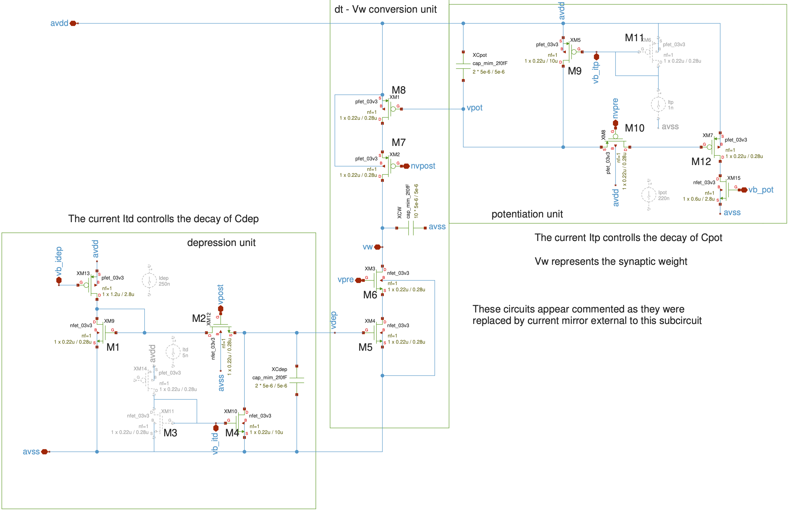
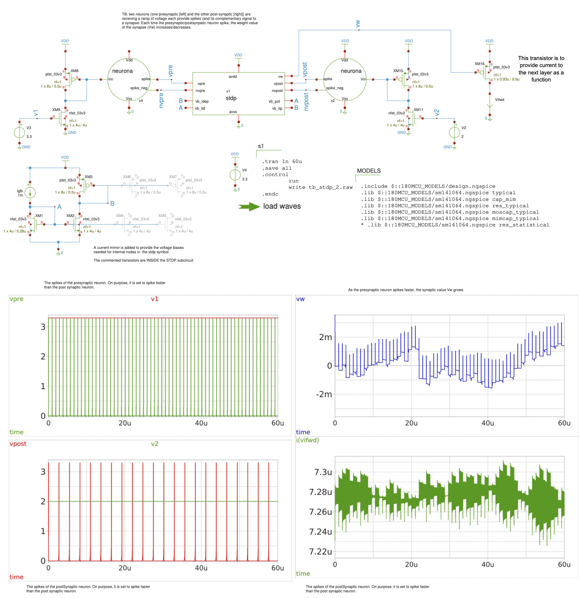

# STDP circuit with linear decay (Updated 16 July)

Based on [1], here is the Synaptic Time Dependant Platicity with linear decay, implemented in the gf180mcuD pdk. 

## How it works

The circuit consists of three main units. The depression unit generates a trace of post-synaptic spikes, $V_{dep}$. The potentiation unit generates a trace of pre-synpatic spikes, $V_{pot}$. The $\Delta t - V_W$ conversion unit detects the time difference between the spikes and calculates the voltage of the capacitor $C_W, V_W$ from the value of the trace $V_{dep}(t)$ or $V_{pot}(t)$ at time $t$. Here, $\delta t = t_{post}-t_{pre}$ is the difference between the time $t_{pre}$, which is the timing of the pre-synaptic spike, and $t_{post}$, which is the timing of the post-synaptic spike. When $\Delta t < 0 (\Delta t > 0), V_W$ is decreased (increased) by the depression (potentiation) circuit. The variation of $V_W, \delta V_W$, corresponds to the change in the synaptic weight of the pre- and post- STDP operations. 

When the output spike $V_{post}$ of the post-synaptic neuron arrives at $t_{post}$, the transistor $M_2$ is turned on, and the capacitor $C_{dep}$ is charged by the current source $I_{dep}$ for a duration of $\Delta t_p$. Then, the pre-synaptic spike $V_{pre}$ turns on $M_6$ and the charge in the capacitor $C_W$ of the $\Delta t - V_W$ conversion unit is discharged, which depends on the potential of the capacitor $C_{dep}$ in the depression unit $V_{dep}$ which is linearly decayed by the drain current flowing through the transistor $M_4$, which mirrors the current source $I_{td}$.

The circuit design of the potentiation unit is symmetric to the depression unit, and thus the weight-potentiation operation for $\Delta t > 0$ is performed based on the same mechanism as the weight-depression operation. When the output spike $\bar{V_{pre}}$ of the presynaptic neuron arrives at the time $t_{pre}$, the transistor $M_10$ is turned on, and the capacitor $C_{pot}$ is discharged by the current source $I_{pot}$ for a duration  of $\Delta t_p$. Here $\bar{V_{pre}}$ is inverted $V_{pre}$. Afther the $\bar{V_{pre}}$ pulse is turned off, $V_{pot}$ is linearly increased by the current flowing through the transistor $M_9$, which depends on $I_{tp}$. The transistor $M_7$ is the turned on by $\bar{V_{post}}$ and the capacitor $C_W$ is charged with an amplitude that depends on $V_{pot}$.

## Design Assumptions

Voltage de alimentacion 3.3V

## How to test (Updated 16 July)
The testbench for this circuit consists into two voltage ramps that fed two voltage controlled oscilators (the neurons). The output voltage spikes $v_{pre}$ and $v_{post}$ and its complementary signales (produced by the not.sch symbols) are fed into the stdp subcircuit. The evolution of the synaptic weight represented by Vw (blue graph) shows how increments and decrements per each incoming spike.

## 📚 References
    - Satoshi Moriya, Tatsuki Kato, Daisuke Oguchi, Hideaki Yamamoto, Shigeo Sato, Yasushi Yuminaka, Yoshihiko Horio, Jordi Madrenas, Analog-circuit implementation of multiplicative spike-timing-dependent plasticity with linear decay, Nonlinear Theory and Its Applications, IEICE, 2021, Volume 12, Issue 4, Pages 685-694, Released on J-STAGE October 01, 2021, Online ISSN 2185-4106, https://doi.org/10.1587/nolta.12.685, https://www.jstage.jst.go.jp/article/nolta/12/4/12_685/_article/-char/en

    - Roy, K., Jaiswal, A. & Panda, P. Towards spike-based machine intelligence with neuromorphic computing. Nature 575, 607–617 (2019). https://doi.org/10.1038/s41586-019-1677-2
